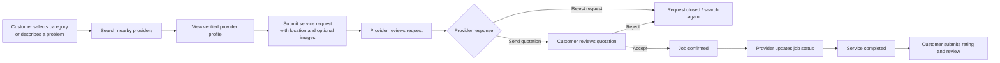
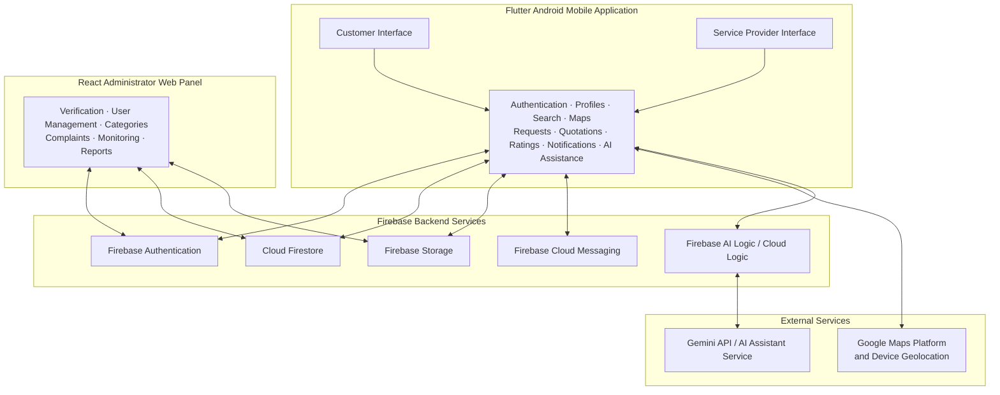

<div align="center">

# Location-Based Mobile Marketplace Connecting Skilled Workers and Customers

### A mobile-first platform for discovering, requesting, and managing trusted local skilled services.

[](#project-status)
[](#technology-stack)
[](#technology-stack)
[](#technology-stack)
[](#technology-stack)

**Independent Study Project 1 · Group 12 · Uva Wellassa University**

</div>

---

## Overview

**Location-Based Mobile Marketplace Connecting Skilled Workers and Customers** is a mobile-based service marketplace designed to help customers discover nearby skilled workers, while improving digital visibility and work opportunities for individual and small-scale service providers.

The platform focuses on workers such as **plumbers, carpenters, electricians, painters, masons, mobile repair technicians**, and other local service professionals who may not have a searchable digital presence. Instead of operating only as a directory, the system provides a structured workflow for service requests, quotations, job status tracking, ratings, reviews, verification, and administrative monitoring.

> The project is currently maintained using its repository/project title. No separate public application name has been finalized.

---

## Problem Being Addressed

Finding a reliable nearby skilled worker for a small or urgent job is often informal and time-consuming. Customers commonly depend on personal contacts, roadside advertisements, or scattered social media recommendations, with limited ability to confirm availability, trustworthiness, or service suitability.

At the same time, many independent skilled workers have limited online visibility and may miss job opportunities from nearby customers who require their services.

This project addresses that gap through a location-aware marketplace that supports **discovery, trust, communication through a controlled request workflow, and service history management**.

---

## Solution at a Glance

| User Role | What the Platform Provides |
|---|---|
| **Customer** | Find nearby providers, view profiles, create requests, receive quotations, track jobs, and submit ratings/reviews. |
| **Service Provider** | Build a professional profile, submit verification documents, receive requests, send quotations, update job progress, and maintain work history. |
| **Administrator** | Verify providers, manage platform records, monitor operations, handle complaints, moderate reviews, and view reports. |
| **AI Assistant Service** | Suggest suitable service categories and improve request descriptions before customer submission. |

---

## Core Workflow



The platform is designed so that requests and quotations remain inside the application workflow, allowing status tracking, service history, trust mechanisms, and future platform enhancements.

---

## Main Features

### Customer Application Features

- Registration, secure login, and profile management
- Search service providers by category and location
- View provider details, verification status, ratings, and reviews
- AI-assisted service category suggestion
- AI-assisted request description generation and improvement
- Submit service requests with location details, preferred time, and optional images
- Receive, accept, or reject provider quotations
- Track current request and job statuses
- Cancel requests where permitted by the workflow
- Rate and review completed services
- View request history and notifications

### Service Provider Features

- Registration, secure login, and professional profile management
- Select service categories and supported working areas
- Upload documents for administrator verification
- Set and update availability status
- Receive and review customer service requests
- Send quotations with estimated service charge, inspection fee, material cost notes, available time, and additional messages
- Accept confirmed work and update job progress
- View job history and performance overview
- Receive request and verification notifications

### Administrator Web Panel Features

- Secure administrator login
- Customer and provider account management
- Provider document review and verification
- Service category and supported location management
- Service request, quotation, and job monitoring
- Complaint management and review moderation
- Summary activity reports and platform statistics

---

## AI-Assisted Capabilities

The system uses AI only as a practical support feature within the service request workflow.

| AI Feature | Purpose | Human Control |
|---|---|---|
| **Service Category Suggestion** | Helps a customer identify a suitable category from a natural-language problem description. | The customer reviews and selects the final category. |
| **Request Description Generator** | Converts short or unclear input into a clearer request description. | The customer reviews and edits the description before submitting. |

### AI Scope Boundaries

AI does **not** approve providers, assign jobs, make final service decisions, resolve complaints, or replace administrator review.

---

## System Architecture



### MVP Application Model

The MVP is planned as:

- **One Android mobile application** with role-based customer and service-provider interfaces
- **One web-based administrator panel** for platform management
- **Firebase-backed cloud services** for application data, authentication, files, and notifications

---

## Technology Stack

| Layer / Module | Technology | Purpose |
|---|---|---|
| Mobile Application | **Flutter, Dart** | Develop the Android application with role-based interfaces. |
| Administrator Panel | **React** | Build the web dashboard for platform administration. |
| Authentication | **Firebase Authentication** | Secure registration and login for user roles. |
| Database | **Cloud Firestore** | Store profiles, requests, quotations, reviews, categories, locations, and statuses. |
| File Storage | **Firebase Storage** | Store profile images, job images, and verification documents. |
| Notifications | **Firebase Cloud Messaging** | Deliver request, quotation, job, and verification notifications. |
| AI Assistance | **Firebase AI Logic / Gemini API** | Support category suggestions and request description improvement. |
| Maps and Location | **Google Maps Platform & Geolocation APIs** | Capture/select locations and support nearby provider search. |
| Version Control | **Git & GitHub** | Source-code management and team collaboration. |
| Testing | **Flutter widget tests, selected unit tests, manual testing** | Validate core workflows and usability. |

---

## Functional Scope

### Service Request and Quotation Lifecycle

```text
Pending Request → Quoted → Quotation Accepted / Rejected → Confirmed Job
→ In Progress → Completed → Rated & Reviewed
```

The system maintains synchronized request and quotation statuses for customers, providers, and administrators.

### Trust and Safety Mechanisms

- Provider verification managed through the administrator panel
- Ratings and reviews available after completed services
- Complaint handling and review moderation support
- Limited contact/communication exposure until a request is accepted, where required
- Authenticated, role-based feature access

---

## Quality Requirements

| Quality Area | Project Target |
|---|---|
| Performance | Nearby provider results should display within **5 seconds** under normal internet conditions. |
| Compatibility | Main mobile flows target **Android 8 or newer** devices. |
| Efficiency | Uploaded images should be compressed before storage to reduce bandwidth usage. |
| Security | Authenticated access, role-based authorization, input validation, and Firebase Security Rules. |
| Reliability | Important platform records remain stored in the cloud and statuses stay synchronized across roles. |
| Usability | Simple interfaces designed for users with basic digital skills. |
| Maintainability | Modular feature organization, reusable UI components, and collaborative version control. |
| Scalability | Architecture supports additional categories, areas, users, requests, and future platform services. |

---

## Getting Started

> Development setup may evolve as implementation progresses. Keep environment files and service credentials secure and follow the team's agreed repository policy.

### Prerequisites

Install the following tools before running the mobile application:

- [Flutter SDK](https://docs.flutter.dev/get-started/install)
- [Dart SDK](https://dart.dev/get-dart) — included with Flutter
- [Android Studio](https://developer.android.com/studio) or Visual Studio Code with Flutter extensions
- Android SDK and an emulator or physical Android device
- [Git](https://git-scm.com/)
- A configured Firebase project for cloud-connected features

### Run the Flutter Mobile Application

```bash
# Clone the repository
git clone <repository-url>

# Navigate to the project directory
cd location-based-mobile-marketplace-connecting-skilled-workers-and-customers

# Install dependencies
flutter pub get

# Check your environment
flutter doctor

# Run the app on a connected device or emulator
flutter run
```

### Firebase and External Service Configuration

The implemented features may require configuration for:

- Firebase Authentication
- Cloud Firestore
- Firebase Storage
- Firebase Cloud Messaging
- Firebase AI Logic / Gemini API
- Google Maps Platform and device geolocation permissions

Do not commit sensitive files such as **service-account credentials**, **private API secrets**, **signing keys**, or local environment secrets to the repository.

### Administrator Panel

When the React administrator panel module is included in the repository, the general development workflow will be:

```bash
cd admin-panel
npm install
npm run dev
```

---

## Planned Logical Modules

```text
Mobile Application (Flutter)
├── Authentication and Role Management
├── Customer Profile and Provider Profile Management
├── Service Categories and Location-Based Search
├── Map and Location Selection
├── Service Requests and Optional Image Uploads
├── Quotations and Job Status Tracking
├── Ratings, Reviews, and Notifications
└── AI-Assisted Request Support

Administrator Panel (React)
├── Dashboard and Authentication
├── User and Provider Verification Management
├── Category and Location Management
├── Request, Quotation, and Complaint Monitoring
├── Review Moderation
└── Reports and Platform Statistics
```

---

## Development Methodology and Roadmap

The project follows an **iterative development methodology**, allowing the team to implement core features first and improve the platform through feedback and testing.

| Iteration | Weeks | Focus | Expected Output |
|---|---:|---|---|
| Iteration 1 | Week 1–3 | Requirements, research, system design, UI planning | Finalized requirements, diagrams, and UI wireframes |
| Iteration 2 | Week 3–5 | Authentication, roles, customer/provider profiles | Login, registration, dashboards, and profile modules |
| Iteration 3 | Week 6–8 | Location search, maps, and AI features | Nearby provider search and AI request assistance |
| Iteration 4 | Week 9–11 | Requests, quotations, job status, notifications, ratings | Complete service workflow |
| Iteration 5 | Week 11–15 | Admin panel, integration testing, fixes, documentation | Complete MVP and final demonstration |

---

## Git Workflow

The project uses GitHub for collaboration and version control. A recommended contribution workflow is:

```bash
# Start from the latest development branch
git checkout develop
git pull origin develop

# Create a feature or fix branch
git checkout -b feature/<short-feature-name>

# Commit changes
git add .
git commit -m "feat: describe the implemented change"

# Push branch and open a pull request into develop
git push -u origin feature/<short-feature-name>
```

### Branching Convention

| Branch Type | Purpose | Example |
|---|---|---|
| `main` | Stable milestone or final release-ready code | `main` |
| `develop` | Integrated development branch | `develop` |
| `feature/*` | New functionality | `feature/customer-authentication` |
| `fix/*` | Bug resolution | `fix/firebase-storage-build-compatibility` |
| `docs/*` | Documentation updates | `docs/update-readme` |

All feature work should be completed through branches and reviewed through pull requests before merging into protected branches.

---

## Future Enhancements

The planned MVP is designed so that the following capabilities can be introduced later without major redesign:

- In-app chat between customers and service providers
- Online payments and platform commission handling
- Advanced recommendations using distance, rating, availability, and completed-job history
- Subscription packages or promoted provider listings
- Multilingual support for Sinhala, Tamil, and English
- iOS application support after Android MVP validation

---

## Academic Project Information

| Item | Details |
|---|---|
| Module | ICT 212-2 — Independent Study Project 1 |
| Project Group | Group 12 |
| Institution | Department of Information and Communication Technology, Faculty of Technological Studies, Uva Wellassa University |
| Supervisor | Ms. K.R.R. Premathilaka |

### Team Members

| Name | Registration Number |
|---|---|
| D.S.R. Dissanayake | UWU/ICT/23/006 |
| M.T. Kaushalya | UWU/ICT/23/002 |
| K.D.P. Kandegama | UWU/ICT/23/064 |
| L.R.N.P. Rajakaruna | UWU/ICT/23/073 |
| W.M.D.H. Chathumina | UWU/ICT/23/021 |

---

## Project Status

🚧 **Under Development** — The project is currently being developed as an academic MVP focused on Android-based customer/provider workflows, location-aware provider discovery, AI-assisted request creation, cloud-backed service operations, and an administrator management panel.

---

<div align="center">

Developed by **Group 12** as part of **Independent Study Project 1** at **Uva Wellassa University**.

</div>
